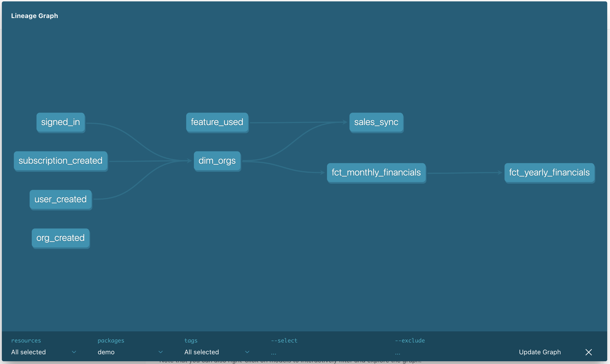

# data-diff-demo
Demo of data-diff with a dbt project using dbt-duckdb

### What's in this repo?
This repo contains [seeds](https://docs.getdbt.com/docs/building-a-dbt-project/seeds) that includes fake raw data from a fictional app.

This project includes raw data from the fictional app, and a few downstream models, as shown in the project DAG:

<p align="center">
    
</p>

## Prerequisites

Verify that `python3` and `git` are installed and available:
```shell
python3 --version
git --version
```

## Clone

Clone this repo using HTTPS:

```shell
git clone https://github.com/datafold/demo.git
cd demo
git checkout duckdb_demo
```

</details>

## Install
Create a virtual environment and install dependencies using `bash`/`zsh`:

```shell
python3 -m venv env
source env/bin/activate
python3 -m pip install --upgrade pip
python3 -m pip install -r requirements.txt
source env/bin/activate
unset DBT_PROFILES_DIR # applicable if you have a DBT_PROFILES_DIR variable set
```

## Setup

Establish the baseline production tables:
```shell
dbt build --full-refresh --target prod
```

Establish the baseline dev tables:
```shell
dbt build --full-refresh
```

## Usage

Simulate a change to the table during development:

Go to `models/core/dim_orgs.sql` and comment out the `prod` CTE for the `dev` CTE

Run a single model & diff
```
dbt run -s dim_orgs && data-diff --dbt
```

Run model + all downstreams & diff
```
dbt run -s dim_orgs+ && data-diff --dbt
```

Run a single model with a `select`
```
data-diff --dbt --select fct_yearly_financials
```

## Wrap up
Deactivate the virtual environment when finished:

```shell
deactivate
```

## Afterwards
Use data-diff in your own dbt repo by following the instructions here:
https://docs.datafold.com/development_testing/open_source
