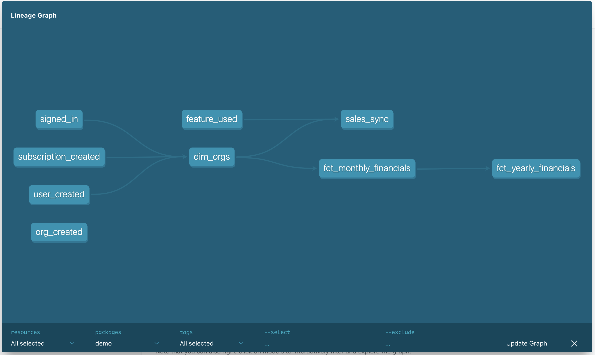

# Datafold Demo Project

This repo contains a demo dbt project suited to leveraging Datafold.


### What's in this repo?
This repo contains [seeds](https://docs.getdbt.com/docs/building-a-dbt-project/seeds) that includes fake raw data from a fictional app.

This project includes raw data from the fictional app, and a few downstream models, as shown in the project DAG:

<p align="center">
    
</p>

## Prerequisites

Verify that `python3`, and `git` are installed and available:
```shell
python3 --version
git --version
```
You will install `dbt` during installation using `pip` if you don't have `dbt` installed yet.

## Clone

Clone this repo using HTTPS (or [your method of choice](docs/clone.md)):

```shell
git clone https://github.com/datafold/demo.git
cd demo
git checkout chiel
```
## Install
Create a virtual environment and install dependencies using `bash`/`zsh` (or [your OS shell of choice](docs/virtual-environment.md)):

```shell
python3 -m venv env
source env/bin/activate
python3 -m pip install -U pip
python3 -m pip install -r requirements.txt -U
source env/bin/activate
unset DBT_PROFILES_DIR # applicable if you have a DBT_PROFILES_DIR variable set
```


## Setup
Establish the baseline production tables:
```shell
dbt build --full-refresh --target prod
```

Establish the baseline dev tables:
```shell
dbt build --full-refresh
```
> **_NOTE:_** To check the expected location of your profiles.yml file for your installation of dbt, you can run the following: `dbt debug --config-dir`. You can change behavior by adding `--profiles-dir .` to your command or by running `DBT_PROFILES_DIR=$(pwd)`. Now you will use the `profiles.yml` at the root of this repo. With `dbt >= 1.5.0` it should automatically pick up the `dbt_project.yml` and `profiles.yml` from the current working directory.
## Usage

Simulate a change to the table during development:

Go to `models/core/dim_orgs.sql` and comment out the `prod` CTE for the `dev` CTE

Run a single model & diff
```
dbt run -s dim_orgs && data-diff --dbt
```

Run model + all downstreams & diff
```
dbt run -s dim_orgs+ && data-diff --dbt
```

Beginning with `data-diff` version `0.7.5` you can add `--select` flag to override the default behavior and specify which models you want to diff.
```
data-diff --dbt --select dim_orgs+
```

You can see the result also in Datafold Cloud or Single Player Cloud using `--cloud`
```
dbt run -s dim_orgs+ && data-diff --dbt --cloud
```

## Wrap up
Deactivate the virtual environment when finished:

```shell
deactivate
```
